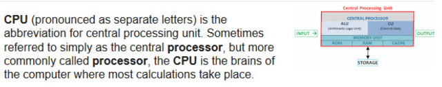

#Design Framework
##Plan and execution
As we were all in different places for this phase, we had to take a highly distributed approach to this milestone’s work. Furthermore, due to poor connection, most of the time videochat wasn’t even an option, so we had to work asynchronously as well.

##Form factor, posture and input methods
Since our app makes heavy use of Augmented Reality (AR), we decided that the form factor should cover the entire viewport, with high-resolution overlay elements that appear directly in the line of sight of the user. However, as will be detailed later, one of the users’ concerns was that the app would require too much attention and would gen in the way of their date. Therefore, we must strive to make the notifications and controls subtle.

Outside of a date, just before it starts, the app could have a **sovereign posture**, since the users wanted to know details about their dates beforehand, such as biography, goals and aspirations. Thus, it would be useful to display this dense information before the date starts, since it’s the time when the user will have the most urgent need for it. On the other hand, once in the date, the app should sit in the background and only notify the user when there is critical information, such as a dangerous topic approaching or a topic suggestion when the conversations runs out. Therefore, during the date, the app should adopt a **daemonic posture**.

Since the user will not be able to exercise much control over the application while in a date, the input methods will have to be indirect, such as hand gestures, head movements and voice commands. However, while in a date, the app has mainly a responsive functionality, which means that it will not require much input from the user.

##Catalog of data elements
These elements have been extracted directly from the requriements.

1. Map
 * Track to follow.
 * Places to select.
 * Distance between your location and the target place.
2. Emotion
 * Colour (for each emotion).
3. Social network widget
 * Profile picture.
 * Pages followed.
 * Interests.
 * Friends in common.
 * Former partners.
4. Online encyclopedia
 * Search bar.
 * Title of the information.
 * Well-organized information.
 * Index.
 * Related somehow with the social network widgets, because we shall be interested in searching the interests that we don’t understand about the other person.
5. Intermittent notifications box
 * Low intrusive appearance.
 * Easy to read.
 * Intermittent (it appears and disappears).

##Functional elements
###Josh:
- Connect (Action) with wikipedia to show biographies or historical facts (objects) that are interesting to know for the user (context).

  1. From our “main view” we can identify an wikipedia search bar showing the title in every moment of the subject that is relevant in that moment form the application point of view.
  2. Josh can see the information about the subject the application decides in any moment.
  3. When seeing the information Josh can select rapidly where to go in an index.

- Connect (Action) to every social network to extract the personal information of the hobbies of the target girl (object) before the date (context).

  1. When Josh starts walking to the date location, a notification will automatically shown in order to open the girl’s profile.
  2. We can open her profile whenever the notification is activated.
  3. When showing the profile Josh can select what to read and when to close it.

- Connect (Action) to Google Maps (object) when requested by the user (context).

  1. A map with your location will be shown in every moment in the “main view”.
  2. In every moment Josh is able to ask for going to different places. At the same time the application is suggesting locations whenever is important from the application point of view.
  3. When the places are found he can select one of them.
  4. A track will be shown whenever Josh selects a target place. Alternative paths can be taken by Josh.

###Aaron:
- Show (Action) the information (Object) in a way that is not very intrusive because the one using it (Context) has to be able to follow the app info at the same time that is having a date with someone.

  1. The “main window” is generally empty in the center and part of the sides.
  2. Notifications will only be shown when it is extremely advisable from the application’s point of view.
  3. Aaron can close any notification as soon he is uncomfortable with it.

###Helene:
- Display (action) a box (object) to see all the previous relationships of the guy and see the comments of their ex-girlfriends beforehand (context). It should search (action) for common hobbies(object) and propose new topics (action) to Helene in the screen when the conversation stalls(context).
 The same as the second functional element of Josh. It can also notify when to talk about some particular topic. (Notice that there are two functional elements in one)

- She wants to know if the guy is trustworthy, so the app has to notify(action) this information and the reasons(object) in advance(context), so Helene does not waste time. The app should notify (Action) if the guy (object) is looking for a long term relationship during the date (context).
 A notification will be shown just the same way as with Aaron. (Notice that there are two functional elements in one)

- The app has to analyze (action) the user gestures and face (object) and find out if the guy is starting to fall in love (action) during the date (context).

  1. We can see the emotional state of the other person permanently in the “main view”.

##Functional groups and hierarchy (first pass)
###Pre-date view
- There should be a field to search for the name of the date.
- Information of his/her social media profiles is displayed and browsable.
- A list of the previous partners of the date will also be available.
- A list of possible topics to talk about will be present.
- The information can obstruct the view (sovereign posture), since the user is not paying full attention to the date yet.

###In-date view (Main view)
- The central space is empty, to be occupied by the date (daemonic posture).
- There has to be a widget to display the emotional state of the date at all times.
- There has to be a space reserved for notifications about:
  - When the user is approaching dangerous topics.
  - When the conversation runs out, a suggestion of topics.
  - Whether the date is lying or not.
- The notifications should be easily closeable.
- There should be a search bar that responds to voice commands. The bar should follow the conversation, and when the user requests “more data”, the bar should already have a digested list of results. The result should not intrude with the central view of the date.

###Moving view
- There should be a search bar to search for places to go.
- There should be a map display, which contains the route to the selected location and suggestions for other locations to move to.

##Sketch of the Interaction Framework (first pass)
The sketches for the first pass of the interaction framework sketches can be found in the folder Prototypes/1st Iteration.

##Keypath scenarios (first pass)
With the initial sketches in hand, we created a series of keypath scenarios to demonstrate the main ways the user can interact with the app.

###Pre-date Keypath Scenario
Josh is having a date this afternoon but he wants to prepare before so he starts the app in the pre-date mode (in which the information occupies the whole screen) because he wants to look for some information about the girl.

So the app starts loading all the information about the girl that Josh is meeting today.
When the information is ready Josh observes that there are several tabs in which the info is organized (social networks, previous partners, hobbies).

He selects via voice command the social network tab (Saying “social network”) and then the Facebook tab (Saying “Facebook”)  in which he wants to see how is the girls relation with his parents because Josh thinks that a person that has problems with his family do also tend to have problems in any friendship or love relation. He finds that the girl do usually post photos with her family which he finds a good thing.

After a while surfing at the girl’s Facebook he wants to know more about the girl’s hobbies so he changes to that tab (Saying “Hobbies”). In it there is a list of the girl’s hobbies and he sees that the first of them is that she loves cats. He had suspected that when seeing her photos but now he is sure about it. The girl’s next hobby is playing basketball and the last two ones watching films and reading. Is then when Josh starts planning somehow some topics for the date and he feels prepared for it, but before meeting the girl he wants a last piece of information he wants to check the “previous partners” tab so he changes to it (Saying “previous partners”) and checks how their previous partners were.

There are three guys and all of them look normal. He realises that all of them are 3 years older than the girl exactly as Josh and that gives him a boost of confidence feeling ready for the date.

###In-date Keypath Scenario
As soon as the date starts the application changes to a different mode, the “In date” mode in which the central space is empty and all the information needed during the date is moved to the sides.

First of all Josh wants to check how is his partner mood so he checks the icon in the right-top corner that shows how it is going. He sees that as the date has just started the app shows his partner mood to be normal(green color) not excited nor bored or angry.
So Josh looks at the right bottom corner where the topic suggestions appear and decides to talk about cats cause the lady he is dating seems to be a cat lover. The problem is that Josh doesn’t know many things about cats and he wants something interesting to tell to the girl about that topic and he decides to search some information in the searching dialog that is on the left top corner using voice commands. He just look for “cat curious information” and he checks quickly the answers until he finds one that may fit his purpose of impressing the girl.
The problem is that after a while talking about cats the icon showing the mood of Josh partner starts to turn yellow (meaning uncomfortable) and a notification appears on the notification’s box telling Josh that he should change the topic of the conversation because the girl is starting to feel uncomfortable so he checks again the list of topics and chooses a different one.

He chooses this time to talk about sports and the move to basketball a well known sport for him and of which is also fan his partner.

After a while talking about sports and basketball the mood indicator of the screen turns to normal (green color) meaning that the girl is feeling comfortable again.

The problem is that is getting late and Josh needs to go because has to work early on the next day and they decide to meet another day cause they both felt quite comfortable with each other.

### Moving Keypath Scenario

Josh and the girl talk about moving to a different place, she would like to go to a quiet park. Josh asks for directions to the app via voice command (Saying “Go to a park”) and the app scans the area to search for nearby parks. Then Josh selects one of them (using gestures) from the list of possibilities that the app has found.

As soon as he selects it, the route to the park is loaded in the app and it starts giving him information about how to get to the park as a normal GPS for the car does.

So they both start the route and carry on with the conversation they were having. Josh realizes that the app information about the route is shown in a very subtle way what he finds a very good idea because he wants to focus his attention on the girl and prefers the app not to be very intrusive. The next step of the route they are following is just shown with a little message below the map.

After a while walking and talking they get to the park and the map starts just showing Josh's position.

##Validation scenarios (first pass)
We decided not to do any validation scenario as we found them not very useful in our app.

This step is usually thought to find some flaws in the design of very complex apps in terms of controls or having too many different views. It is also used to find missing functionalities that were thought but that never reached the sketches, so they aren’t missing in the final product.

Our app only has a few functionalities and screens and our main focus is how to not to be very intrusive for the user while giving enough information in a subtle way.

## First Iteration Takeaways

After discussing the prototypes and keypath scenarios, we distilled a list of changes that we wanted the next iteration to have.

### Pre-date view:

- The first thing that should appear is a sort of cover with the tastes of the date, similar to the one in Daniel’s prototype.
- The size and organization of the tabs will follow Borja’s prototype, except that the active tab will be brighter, and the inactive ones will be darker.
- The search bar was identical in both prototypes, so it should remain unchanged.
- The social networks will not be individually filterable, and instead a digest will appear, containing unified information of each of them.
- The “Iterests” tab will contain information about the last posts made, followed pages and personalities, common acquaitances and former partners.

### In-date view:

- The map will not be present.
- The search bar will be on the top-left side, and will display information with pictures taken from Wikipedia or other sources. Two examples are provided, being the second one better for our app:

- The notification box will be located following Daniel’s prototype with the same size. In the lower part of that same side, there will be a circle with a color that matches the emotional state of the date. Somewhere around that element (not yet decided), there will be a heart bar, similar to that in Borja’s prototype, which aims to know the level of likeness that the other person has for the user.

### Moving View

- Will be similar to In-date view, but in this case the map will be located where the search bar was (top-left), and just below that a text will appear with indications to reach the destination, such as “In 200m, turn left”.

## Functional element changes for the second pass

Upon review of the Functional and Data Elements list, we decided to make some minor changes:

### Catalog of data elements
- Emotion
  - It will now be represented by a colored circle with a set of hearts from 1 to 4 showing how close the date is from falling in love with the user.
  - It will be positioned on the bottom right of the interface.

###Functional elements
- Josh
  - Search bar: The information will always be shown with just a few phrases and some photos so is easier to get the idea without having to read.
  - Map:
    1. A map with your location can be opened in the bottom left part of the interface at any moment by the user during the date. It can be closed once is opened.
    2. When opening the map the app changes to the Moving view in which the Wikipedia bar disappears and the map takes its place in the top-left corner.
    3. In every moment Josh is able to ask for directions to go to different places. At the same time the application is suggesting locations whenever is important from the application's point of view.
    4. When the places are found he can select one of them.
    5. A track will be shown whenever Josh selects a target place. Alternative paths can be taken by Josh.
    6. When following a path the indications like “Turn right”, “Turn left” … will be shown below the map in a very subtly fashion, with the letters as small as possible.

## Sketches of the Interaction Framework (second pass)

The sketches for the second pass of the interaction framework can be found in the folder Prototypes/2nd Iteration.

## Keypath scenarios (second pass)

We modified the previous keypath scenarios to fit the current design.

### Pre-date Keypath Scenario

Josh is having a date this afternoon but he wants to prepare before so he starts the app in the pre-date mode (in which the information occupies the whole screen) because he wants to look for some information about the girl. The app starts loading all the information about the girl that Josh is meeting today.

When the information is ready Josh observes that there are several tabs in which the info is organized (social networks, previous partners, hobbies).

He selects via voice command the social network tab (Saying “Social Networks"), in which he wants to see how the girl's relationship with her parents is. He finds that the girl does usually post photos with her family, which he finds a good thing.

After a while surfing the girl’s Facebook he wants to know more about the her hobbies so he changes to that tab (Saying “Hobbies”). In it there is a list of the girl’s hobbies and he sees that the first of them is that she loves cats. He had suspected that when seeing her photos but now he is sure about it. The girl’s next hobby is playing basketball and the last two ones watching films and reading. It's then when Josh starts planning somehow some topics for the date and he feels prepared for it, but before meeting the girl he wants a last piece of information he wants to check the “previous partners” tab so he changes to it (Saying “Previous partners”) and checks who their previous partners were.

There are three guys and all of them look normal. He realizes that all of them are 3 years older than the girl, just like him, and that gives him a boost of confidence feeling ready for the date.

### In-date Keypath Scenario

As soon as the date starts the application changes to a different mode, the “In date” mode in which the central space is empty and all the information needed during the date is moved to the sides.

First of all Josh wants to check how his date's mood is, so he checks the icon in the top-right corner that shows how it is going. He sees that as the date has just started the app shows his partner's mood to be normal (green color), and not excited, bored or angry.

So Josh looks at the top-right corner where the topic suggestions appear and decides to talk about cats cause the lady he is dating seems to be a cat lover. The problem is that Josh doesn’t know many things about cats and he wants something interesting to tell to the girl about that topic and he decides to search some information in the searching dialog that is on the top-left corner using voice commands. He just queries for “cat curious information” and he checks quickly the answers until he finds one that may fit his purpose of impressing the girl.

The problem is that after a while talking about cats the icon showing the mood of Josh partner starts to turn yellow (meaning uncomfortable) and a notification appears on the notification box telling Josh that he should change the topic of the conversation because the girl is starting to feel uncomfortable so he checks again the list of topics and chooses a different one.

He chooses this time to talk about sports and the move to basketball a well known sport for him and of which is also fan his partner.

After a while talking about sports and basketball the mood indicator of the screen turns to normal (green color) meaning that the girl is feeling comfortable again.

The problem is that is getting late and Josh needs to go because has to work early on the next day and they decide to meet another day cause they both felt quite comfortable with each other.

### Moving Keypath Scenario

Josh and the girl talk about moving to a different place, she would like to go to a quiet park. Josh queries the app via voice command (Saying “Go to a park”) and the app scans the area to search for nearby parks. Then Josh selects one of them (using gestures) from the list of possibilities that the app has found.

As soon as he selects it, the route to the park is loaded in the app and it starts giving him information about how to get to the park as a normal GPS for the car does.

So they both start the route and carry on with the conversation they were having. Josh realizes that the app information about the route is shown in a very subtle way what he finds a very good idea, because he wants to focus his attention on the girl and prefers the app not to be very intrusive. The next step of the route they are following is just shown with a little message below the map.

After a while walking and talking they get to the park and the map starts just showing Josh position.

# Iteration 3

A new team is in charge of the third iteration. Our approach will be different: start working on each of the 6 steps, adding new visions and ideas without being conditioned by the previous iteration. After the end of each step we compare this new ideas with the version from the previous iteration. And then we decide what new elements leave. At the end of this iteration  we will make new sketches, rewrite some parts of the documentation and prepare the work for the next iteration.

Thanks to this approach we can work creatively and without any constraints from prior work, so the value of the new ideas is higher. This is truly important in order to think on new concepts completely free.

## 1. Form factor, postura and input method

### Getting the information from context scenarios

First we will focus on Josh, the primary persona defined in the milestone 2. As we defined, Josh has 4 problems. The reader could go to the previous milestone and see those problems, however we will also include them here to make some improvements.

We are using most of the Josh problems for making the **form factor**. We have rewrite some Josh problems to improve the final design.

- Problem 1: Josh is uncomfortable and doesn’t know what to say.
- Problem 2: The girl is bored of the place where they are and wants to go to do something else. She asks Josh for advice but he is in blank.
- Problem 3: Josh doesn’t know the girl and he doesn’t know where to set the first date in order to success.
- Problem 4: The girl starts a conversation with a subject that Josh doesn’t control (for example a tv star that Josh doesn’t know). Josh is getting out of control of the situation.

Also we think some visions proposed on the previous iteration could be improved. So these are the problems and the new visions for some of them:

- (new vision) Problem 1: a list of topics ordered by percentage of affinity with the girl will be shown on the screen. When Josh starts talking one of the topic from the list, the application will hide the topics. When Josh does not know what to say on some topic, the application will say Josh what to say on this topic. After some minutes, it will generate new topics. 

- (new vision) Problem 3: The application will search all the available information of the girl and will create a summary with the most relevant data. Josh will see (if he asks our application) a summary of the girl interests, hobbies, family members, common friends, basic information, etc. Then the  application will suggest 3 places to do the date (ranked based on the girl information). And finally, Josh can book the restaurant directly from the application.

- (new vision) Problem 4: instead of the raw wikipedia information, the application will show a summary of the most relevant information from different sources (books, newspapers, blogs, wikipedia, etc). Moreover, the application will display 2 sentences to follow up the conversation in this topic.

###Form factor

Our hardware (the lenses) is combined with software (augmented reality application) to offer a great user experience. The lenses are very comfortable and they are smoothly integrated in the eyes, so this is an advantage.

Our product is integrated in the user eyes, so we have the possibility to create a 180 degrees interface. However, we only want to concentrate our design in very defined and **strategic areas** that will let the user to **interact naturally** while receiving a valuable information to have a successful date.

Thanks to augmented reality we have plenty of possibilities to display all elements in the screen. But as we say in the prior paragraph, we are creating a layer on top of the real world that should be performed naturally. So at any time when a new data or notification is available the application will recognize the environment and decide how to adjust correctly the notification (color, size, etc). 

**Night** is the time of the day where the vast majority of our users will use the application. For example, Josh, our primary persona normally hangs out on bars during night.

However, we must take into account that people also dates during the **afternoon** before going to dinner. With this two concepts in mind, we think the best idea is to prioritize the design decisions only for the night environment while validating the design on daylight too.

It's only necessary to wear the lenses while dating. So, we need another way to interact with our product and review their previous dates on a daily basis. So in this iteration we have thought that a mobile app is really important to complement the lenses.

This mobile app will be used normally during the day (for example, when they are at the university, taking food, etc). And the user will see a history of previous dates (where did they go, what topics did they speak and how was the date). Also this app will have the contact information of the girl and a list of contact methods (emails, mobile phones, etc).

###Posture

From previous iteration we realised our application has enough potential to take more part on the dating process instead of being just a daemonic who only acts in the background.

The application will have mainly a **transient posture** while dating. This is more helpful for Josh and non-intrusive (it will still have simple elements on the screen, very well placed and the information will not appear all the time). We changed our vision from iteration one because we realized Josh has serious problems while dating because he is really insecure and he needs more help to feel he has the control.

However, this transient posture will not be applicable all the time. The application will adopt a **daemonic posture** on intimate moments, when the user is feeling self-confident and secure. So this will let the passion and magic flow.

### Input methods

In this iteration we are defining in depth the input methods in order to give a proper vision of the product. 

The **voice** is the primary input method. The lenses are listening for keywords/sentences all the time and based on the audio it takes the correct action. This approach is the most unobtrusive and elegant.

The application only recognizes the voice from the owner of the lenses. So if any other people around say some keywords, the app will ignore it.

As we said, the voice is one of the main sources that the augmented reality app uses to work properly. But, the mobile app we introduced in this iteration uses **touch screen** to work. 

Talking about inputs, we have to note that the application also receives information from the outside world: gestures, facial expressions, voice of the girl, weather in the zone, reactions, etc. Although these are not input methods from the user who is using the application, this is extremely related and it is really useful to know what information the application sensors will receive.

##2. Define functional and data elements

### Preparing the requirements

In this second phase of the iterative process we are taking into account mainly the requirements from the primary persona but also having some other requirements from the secondary personas (the ones we think are more important or critical). 

During the first step on this second iteration we have added new visions to solve Josh problems. So it's advisable to revisit and adapt requirements to the new vision taking by the designers in this second iteration.

In the following list you can see a list of the requirements we will take into account in the following steps. All of them are based on the requirements from the user but they have been adapted and also rewritten from the first iteration. We have prioritize the requirements from the primary persona but also we have included extra requirements from the secondary personas.

- The summary of the girl is displayed in the screen. This information is extracted from social networks and family connections.
	* The user can configure if he/she wants to see previous relationships history inside the girl summary.

- The list of conversation topics are displayed in the screen taking into account the girl hobbies and knowledge.
- A bunch of **sentences** to speak about a topic are generated and suggested to the user in the screen. This information is extracted from different sources: books, blogs, videos, wikipedia...
- The voice recognition system hears the user commands and take the correct actions.
- A sensor to identify the emotional state of the girl is required. The emotional state is calculated given different variables (gestures, expressions and voice), it's shown in the screen.
- A non-intrusive approach should be taken when designing the application so the users can focus on the conversation while reading the extra information.
- The app analyzes constantly the gestures, expressions and feelings from the other person and says how is she feeling.
- A list of suggested places to have the date or to move in, ranked by girl preferences is shown. Also the application can book directly. 

### Catalog of data elements

Taking into account the information written in the prior block *Preparing the requirements* we are defining the data elements of the application.

#### Summary of the girl

We need to display the following information:

- Personal data: name, age, studies or work.
- Hobbies.
- Common friends.

Optionally, the user can configure the application to:

- See a history of the previous relationships.
- Members of the family.
- Kind of relationship she is looking for: long-term or short-term.

#### Conversation topics

- Suggest 3 topics to talk given the girl interests, background and hobbies.
- Automatically display new topics when the girl is getting bored.

This is related with the data element *Sentences to talk about a topic*. So first the topics are suggested and then the application propose smart and excellent sentences to say about the topic.

#### Sentences to say about a topic

When the user doesn't anything about a topic or maybe he doesn't know what to say, the application will help him to say smart and excellent sentences. 

In order to accomplish this, we need:

- Propose a list of 3 sentences to say about the topic.
- Obtain the information from many sources and create a valuable sentence to impress the girl.

Optionally, the user can configure the application to propose the sentences plus a brief summary of the topic. This summary is only shown the first time the new topic is used.

This data element is related with the prior one. Because the application proposes topics that are relevant for the users and then creates smart sentences around it.

#### Emotional state

- Calculate the emotional state of the girl using the gestures, expressions and face sensors.
- The application will show the percentage. So the user can learn what are the topics the girl loves and also can use the information to take decisions.

#### Suggested places

Our primary persona does not know where to organize dates. Neither when is the correct time to move to another place because the girl is bored or because it's the time to take the date to a higher level.

So before the date, the user will receive in the mobile application a list of suggested places given the girl preferences. Then Josh, can book it directly through the application.

On the date, the augmented reality app will notify the user if it's the time to move to another place.

- The mobile app will propose 3 places to organize the date.
- The augmented reality app will analyze the girl preferences and propose 3 places to move when it's the right moment.
- All of the place are ranked by the girl preferences.

This is related with the *Booking the place* data element, because the app will let the user to book the place.

#### Booking the place

After the application proposed the places, the user can book directly a table or a place. 

- When the voice microphone heard 'Let's go to Hard rock cafe restaurant', the app will automatically book a table.
- Also the application will start a navigation map.

This data element is related with the *Suggested places* because you select and book a place. And also with the map element, because it will guide you to the destination.

#### Map

- A map to go to the place is generated and the application help the user to reach his destination.
- Distance is calculated given your current location.

This is related with the two prior data elements.

#### Configuration of the application

The following list is the options the user can configure to personalize the experience using the application.

- Decide to show a brief summary of the topic.
- See a history of the previous relationships.
- Show members of the family.
- Kind of relationship she is looking for: long-term or short-term.
- For how long the girl summary should be seen on the screen.

### Functional elements

After defining the new requirements and also the data elements, we need to translate all this information into defined user actions in the application.

- Get <action> a conversation topic <object> when the user wants to know what to say
  The application is constantly analyzing the girl (movements, gestures, feelings).
	1. The conversation is starting to be not so interesting or the girl is not comfortable.
	2. The application generates 3 new topics, taking into account the girl preferences, the man knowledge and also the state of the date (eg: starting, end of the dinner, etc).
	3. When the man starts talking about the topic, the application automatically recognize it and hides the rest of the topics.

- Read <action> a summary of the girl <object> when the user wants more information <context>
	1. The augmented application analyzes the face of the girl and search all the available information online
	2. A brief summary of the girl is shown on the screen. The application finds the best place to put the summary depending on the situation.
	3. The summary disappears after some seconds (this is configured by the user)

- Get <action> sentences to say about a topic <object> when the user is insecure or doesn't know what to say <context>

	1. The application sensors recognize that the user is insecure or does not know what to say.
	2. The application generates a list of topics, ranked by popularity (the most relevant for the girls).
	3. The user says the sentence.
	4. The application microphone recognizes that the user has used one sentence and hide the rest of the sentences.

- See <action> emotional state of the girl <object> every time of the conversation <context>

	1. The application camera analyzes the face of the girl and also the gestures and expressions.
	2. The emotional state is recalculated at real time and it is display on top of the view.

- Get <action> a list of suggested places <object> to make the date or to go there <context>

	1. The girl wants to move or the man wants to book one restaurant.
	2. The application will automatically generate a list of suggested places (ordered by girl preferences).
	3. The man says "Let's go to NAME" and the list disappears

- Book <action> a restaurant or a place <object> for a date <context>
	
	1. After the man says "Let's go to NAME", the application hides the suggested groups.
	2. The application makes an order or a reservation in the chosen place.
	3. The application notify the user that the reservation has completed.

- See <action> the map <object> when the user wants to go to the place <context>
	
	1. When the user says "Let's go to <name of the restaurant>" the application automatically calculates the best route and start the navigation mode.
	2. The indications are displayed on the screen with arrows.
	3. When they arrive to the place, the navigation mode disappears.

- Configure <action> the application <object> at home <context>
	
	This action can be done in both applications (mobile or augmented reality). The only difference is the way to accessing the feature.

	In the augmented reality:

	1. The user says "Go to configuration" and the configuration options are shown.
	2. All the options are displayed in the screen
	3. The user uses the hand to pick one attribute and change the value.
	4. The user says "Go home" and it exits.

	In the mobile app:

	1. The user clicks on configure
	2. Then, he selects the field to change.
	3. The field value is changed.
	4. The user exists.

##3. Functional groups and hierarchy

In this iteration we are going to change the structure and content from the previous iteration. We are focusing more on the **two goals for the user**: getting information about the girl (flirting) and be successful while dating.

So there are two functional groups. Because one is the group when you want to get information about the girl or maybe you want to remember a date you have with the girl. The second one is when you are having the date with your love.

- Flirting.
- Dating.

The application will work differently in both cases because the goals of the user change in each case. In the first he is trying to get information or remembering a previous date. And in the second is when you are already with the girl, so the app will help you to get the love.

#### Flirting

This includes all the situations when you are flirting with the girl, like chatting, seeing at first time or after the first date. Because our application can record too all the previous dates you have with the girl or helping you to get the date.

**Views:**

- Summary of the girl.
- Pick a place to date and book it.
- Configuration of the application.

#### Dating
 
Now the user goal is **getting the girl**. So in this case the application will help you to have an awesome date and to get the true love. 

We have included all the features related with having a conversation, knowing the girl emotions and also to move to another place. 

**Views:**

Chronological order:

- Conversation topics.
- Sentences to say about a topic.
- Emotional state.
- Go to another place and book it.
- Map navigator.

##4. Sketches iteration 2

#### Design notes

Conceptually, we will divide in **three containers**: dating, flirting and configuration. By default, the application will be on flirting mode, but the user can change at any time.

The application is designed like **a layer on top of the real world**. So the user uses the voice to navigate through the different parts of the interface..

We have decided to let the application choosing where to place the **notifications depending on the position of the girl**. Now it will use different techniques to measure the distances between left, right, top and bottom margins. For example, if the girl is situated on the left part of the screen, the application will place the notification on the right part and vice versa.

However, in our sketches we will place the girl on the middle/right part of the screen so the notifications will be on the left side.

Visually, the application will be really minimalist and will have minimal elements. The 'views' are different layers that the application puts using augmented reality.

#### New sketches

The user will only use the voice to navigate through the application. This is challenging but very interesting from the designing point of view.

##### Main window

So the user starts the application with the main view.
Here he can selects which mode he wants to use.

For example, the user says: "I want go flirting"

##### Girl summery

The application uses the camera to analyze faces. If it's the first time the user see a girl, then a summary is shown. 

The summary contains all the important information. Also there is some extra information that the user can show. This extra fields are configured in the configuration view (continuous reading).

##### Places to make a date

The user says: "Show me a list of places to eat" or if the user is having a date, then he can say some secret keywords like this: "Hey girl, I want to have a dinner with you", so the application recognizes the user purposes and then shows a list of places.

The places are selected taking into account the girl hobbies, experiences, background and so on.

##### Make a reservation

Then the user can say: "Let's go to Hard rock cafe". Then the application automatically make a reservation and also initializes the map (to see the map views you have to scroll down in this document).

##### Account configuration

The user says "Go to configuration" and then he can configure some extra stuff that appears on the screen.

To active something the user says: "Activate show members of the family"

##### Conversation topics

While dating, the application will show a list of topics to talk. This list only appears if the application detects the user is nervous, does not know what to say or the girl is bored.

When the user start talking on one of the topics, the application automatically hide all the topics from the screen

##### Sentences to say

On any topic, the application proposes smart sentences to say about the topic.
This feature can be deactivated from the configuration view.

##### Emotional state

While dating the application shows the emotional state of the girl. Some of them can be: 'bored', 'happy', 'loved', 'calmy', 'aggressive'.

##### Navigation map

After the user has selected a restaurant the application automatically starts the map navigation.

Also the user can activate this feature saying: "Hey. let's go to Goiko restaurant". The app searches the location of the restaurant and starts the navigation.

The following sketches are the different indications the user will receive: go left, right, etc...

When the user arrives, the application automatically hides the navigation mode.

### Comparing sketches with the first iteration

We think that from the first iteration there was some cool ideas. For example, the notifications bar or the love icons. However, some parts of the concept didn't go well. In our opinion, giving the raw information is bad, because he can't spend time reading many stuff while dating. 

In this iteration, we solved this problem being more precise and direct to the information the user should say. So we add the 'sentences suggestion' that let the user reply with smart sentences on any topics. 

Also, we try to simplify the UI elements. And now the notifications are displayed depending on the available space.

Also, we have added more views for making a reservation and changed the maps. We basically use arrows to notify the user what to do.

And we have removed the hearts and put a fixed warning about the state of the girl on the date.

In general the first iteration was a good work but we have improved and simplified many stuff.

##5. New keypaths and some validation

In general the new sketches fits better with the keypath scenario. In this iteration we have redefined some of the previous keypath scenarios because the way of interacting with the application has changed slightly.

Now we will write some new keypath scenarios for the new sketches and also writing new validation scenarios.

#### Keypath 1: flirting

The user is alone at home and put the lenses. Then he goes to the university and see a beautiful girl. Then, the application automatically recognize her face and display all the girl information in the screen.

Then, the application generates a list of places to make a date. All of this places are the favourite ones of the girl.

Then our application shows a message in the screen saying: "Go to the lady and say: 'Hey, I think you are the kind of girls who loves Hard rock Cafe. Aren't you?".

The lady is shocked, because she has never met a guy who know she loves this place. So the application updates the emotion message to: 'Impressed and open to meet'.

Then our app displays all the hobbies of the girl and she loves 'Harry potter films' so the application display another message: 'Say: Hey, I know this could sound weird but your face looks like Hermione Granger'

The girl was surprised and say: 'What? Hermione is my favourite character of harry potter. I'm a big fan!'.

Then the application displays a message on the screen and says: 'Say: wow! Really? I'm a big fan too! haha. I heard that there will be an special event about harry potter on Hard rock cafe next tuesday. Do you want to come with me?'.

And the date was done thanks to our application!

#### Keypath 2: dating

So the tuesday, both were meeting on Hard Rock Cafe. Our man, put the application on dating mode, saying: 'Go on dating'.

The girl was incredible and Josh was really nervous and he went blank. However, the application suggested 3 topics to speak: Tennis, love films and trips. She love all those topics and Josh started to speak about tennis. 

Then all the topics disappeared and the application suggested some sentences. We have to say that Josh doesn't know anything about tennis... However, the app put: "Hey Vanesa, I'm a big fan of Pete Sampras. Do you like him".

Vanesa was super happy! Because Pete Sampras is her favourite tennis player. Then the application says more sentences like: 'I love the match Boris Becker in 1996. It was amazing and Pete won!'. Surprisingly this is the favourite match for Vanesa. Both were talking hours about tennis, love stories, adventures... So our app was working really well.

Then the application suggests Josh 3 more intimate places to move. Because it's the time to go to the next level. So then Josh says: 'Hey vanesa. Would you like to go to circulo de Bellas artes rooftop'.

Curiously, this is the favourite place of Vanesa in Madrid (well is not so curious, the application is doing the magic). So she say yes.

Then Josh says: 'Okey! Let's go to Circulo de Bellas artes'. So the application automatically booked a private place there and started the navigation mode.

At the end of the date, in the circulo de bellas artes, the emotion of Vanesa was: 'Starting to feel in love'. So the application suggests: 'Josh. It's the moment to give a kiss. Go!'.

And this is the end of this happy story. Josh and Vanesa are now happily engaged and this story has a happy ending.

## Iteration 3: final thoughts

The team has enjoyed a lot working on this iteration because the process was very creative and really challenging. We have improved many stuff from previous iteration, redefined some concepts and added new incredible functionalities.

The first iteration has some good ideas. However there were many things to improve and this iteration was hard and a long process. But we are happy with the result.

The working process starting from a non-opinionated and very creative state of mind was crucial to improve the previous designs. Also, we found really interesting to compare the new ideas with the first iteration so to choose the best of them. In general terms, we have redesigned from scratch many stuff, but both iteration has great things on it.

In general terms, our product is starting to be very defined and we can't wait to start the new iteration to think if we want to add some new functionalities (if needed) and to make a higher fidelity designs.

In the future of our application we would like to also create the mobile app to let the user get more information without needing the lenses

# Iteration 4

So from the previous iteration we have done many work and we are ready to start working on higher fidelity designs!

We think there are some extra functionalities that could be added to the product, for example a catch liars detector. But we have decided not to work on new functionalities, because the core of the application is done and this new features do not add any new interesting things to our targeted personas.

So now we are focusing on creating the higher fidelity designs. We have started to work from the mockups and this is the final result:

The application will recognize the face of the girl and displays the information of the girl.

And now the user sees a list of topics to speak with the girl

We have checked that the design is valid taking into account the previous work for the milestone 2 and the keypaths.
