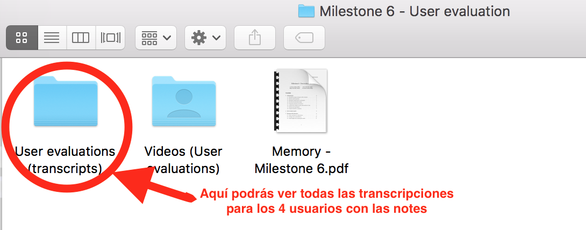

# Evaluation plan
## Identify the purpose and goals of the evaluation

We want to evaluate how the candidate users of our application will interact and interpret our new disruptive interface so we can analyze what are the main problems they could have while using our application. 

In the next part, we will define a set of research questions to specify what are the precise pieces of information we are looking for in this evaluation.

We need to do this evaluation in order to validate our design concepts and also the overall idea of our application. Also we want to check what are the feelings of the users interacting with the product, and it it truly allowed the users to improve their love lives. As a secondary goal, we wanted to gather information about the general feeling towards the app, as the research showed that it could potentially be considered intrusive. In general, we want to test our application with **real users** for **usefulness** and **acceptance** of our target audience.

## Specific research questions

We want to create a set of 5-10 research questions that are aligned with our goals in this evaluation. They aim to be specific, precise and measurable. The data gathered in the interviews should help us determine answers to these questions.
 
* Can they know why the emotion state of the girl changes during the date?
* How well do users interpret the list of topics?
* Do the users know how to pick one conversation topic and start talking?
* Do the users understand that the list of topics/sentences are ordered by the other person's preference?
* Do they understand the different modes (dating, flirting, configuration) of the application?
* Is it easy to book a place (restaurant or club)?
* Do users always find the information they need?
* Do users know how to interpret the navigation mode?
* Is it easy to operate the controls with voice?
* Are application flows easy to understand?

## Identify the requirements for participants

We aim for people of these characteristics:

* A person who is finding a long-term relationship.
* Student or young boy/girl who is insecure and doesn’t know how to flirt.
* A person who doesn’t have initiative or is uncomfortable proposing plans.
* A person who likes talking but doesn’t know how to be nice with a girl/boy.
* He/she doesn’t interpret well the non-verbal messages.
* A person who has some experience dating. So they know what are the things they are looking for in a girl.

## Describe the experimental design

Due to the focus of our application we think the **scenario tasks** are the best to give the user the freedom and information to use our application. So we don’t want to infer in the way he/she interacts with our product.

During the evaluation we will only provide some of the following scenario tasks:

* Imagine you are in the university library. A girl starts talking with you. Your goal is getting as much information about the girl as you can and create a first good impression.
* You’re in a club and see a beautiful girl, your goal is dating with her and go to another place.
* It’s thursday and you’re eating in the faculty. You see a beautiful girl so you put on your Visualdating lenses. Your goal is to get a date with the girl.

## Prepare the evaluation environment

The session will be held in two places. The first one is the library rooms of the Computer science college and the other will be in a classroom. Some of the interviews will be on the library room and others in the class. So we can make tests in two different environments.

The interviews will have a moderator and a user. Another member of the team will be controlling the prototype in the background and the two remaining members will be listening and providing support for any contingency. Also we want to try one interview with 2 moderators (the last one), so we can experiment how well it goes.

Both places have a projector, so we will put the prototype in a big screen so we can simulate the real world. We will use Quicktime in a mac for screen recording, to correlate it with the user reactions, and a Sony camera to record the users, so we can analyze their reactions.

## Conduct the evaluation sessions and moderator’s tasks

Our application is really experimental so we don’t want to contaminate the interview process. The moderator should only provide the minimum indications and let the users move freely through the application. Also the moderator must ask for clarification when something is not clear and also try to make the users think-aloud and express themselves. 

* **What information will the moderator give?** The application is controlled with voice commands. It will help you dating. It’s augmented reality so you will use this app in the real world. You should act like you’re dating a real girl. Don’t talk to the app, talk to the girl and the app will interpret you.
* **Should the moderator help the users if they get stuck?** No. The moderator should try to **ask questions** to the user about the functionality, but never resolve the problem. He should let the user solve the situation.
* **Under what conditions is the intervention acceptable?** Only when the user is not interpreting correctly the indications or when the user is truly nervous. Also, the first reaction of the moderator should be to remind the user to think-aloud.

During the interviews we should enforce the interviewee to think-aloud. The moderator should remind the user to do it. The guy controlling the prototype should be coordinated with the interviewee and change the screen depending on the situation and user decisions.

## Find and select participants

We have selected a list of users who fit in our requirements. We mainly looked for young people. We knew them so we were sure that they were the target people.

In total, we have gathered 4 students (1 girl and 3 boys). The average age is 20 years old. These are the main features of all the people:

* **Esther:** lesbian, good student, looking for a long-term relationship.
* **Raul:** heterosexual, introvert, very smart, lonely guy.
* **Pablo:** heterosexual, shy, video games freak, normal intelligence but hard worker.
* **Roberto:** heterosexual, indecisive, has experience with dating and doesn’t have a clear academic path in mind.

## Prepare materials for evaluation

We have talked before about the script and orientations the moderator should give. We have collected here the final result:

* **Script for prior orientation**: “Application that is controlled with voice commands. The app will help you dating. It’s virtual reality so you will use this app in the real world. You should act like you’re dating with a girl. Don’t talk to the app, talk to the girl and we will interpret you.”. And then we provided some help to meet the goals (filling the keypaths scenarios). This part will be free for each of the moderators, so we don’t have a fixed plan. Instead, we will examine different scenarios.

* **Tools for collecting data** Video camera + microphone, mac screenshot capture (quicktime), google slides for making the prototypes, projector (provided by the university), microphone and paper notes.

* **Prototypes to be evaluated** From the previous 	prototype for the “heuristic evaluation” we have made many improvements including more use cases and scenarios (conversation topics, navigation mode, etc).

---

# User evaluation reports

We have evaluated each of the interviews with two members of the team per each interview. You can check out all the transcripts with the notes, feelings, quotes and reactions of the user in the folder **"User evaluations (transcripts)"**

# Outcomes of the interviews
## Final conclutions for each interview
#### User 1: Final conclusions

**Notes on the interview:**

* She was excited when starting to use the application. 
* She was the only person who was totally confident during the interview.
* She understood the context very well, and got into the dating mental state.
* She needed the least information possible.
* The interview wasn’t interrupted at any moment and went smoothly.
* She didn’t pay much attention to the emotional indicator until the end of the date.

**Positives:**

* She seemed to enjoy herself, showing a playful attitude even when the “Bored” state appeared.
* She used the app the way we think it should be used.
* The interview went well, she understood the way to interact with the app very quickly, and wasn't too surprised by any functionality.
* She formed full sentences to interact **with the other person**, and not the app.

**Negatives:**

* The configuration window confused her, because she didn’t know what any of the options meant. When the app showed the “Mutual friends” information, she grasped the concept immediately.
* She didn’t notice that the reservation was made, it was not very clear for her.
* She felt slightly bothered by the suggestions, she felt that they were forced upon her.
* Since she was so confident, she didn’t need to pay much attention to aspects of the application such as the emotional state indicator. Therefore, not much information was gathered about these components.

#### User 2: Final conclusions

**Notes on the interview:**

* Started by giving **direct voice commands** to the app, it took some time to figure out that the application responded to him.
* Sometimes he would stop focusing on the application, and just turn to the moderators and **suggest improvements** for the app. Some of the main points:
* The app's suggestions should be less specific, let the user word the sentences themselves.
* The user should be able to make reservations at a later time.
* The emotion indicators should provide a bit more information.
* When he got used to the responsiveness of the app and he **relaxed**, he noticed the functionality on the edges (navigation, emotional status display...), which before he hadn't noticed. However, when he discovered them, he **liked these widgets** very much.
* When the app didn't tell him exactly what to do, he felt nervous and resorted back to issuing semi-direct commands (e.g. "Le pregunto si le gusta el tenis").
* He seemed **spooked** by the notion of the girl not knowing that he was using the app.
* He was very interested in knowing **information** about the girl **beforehand**, especially her relationship status.

**Positives:**

* Once he got a hang of the interaction with the app, he assimilated new functionality very quickly.
* He appreciated all the information the app could provide about the girl (relationship status, hobbies...).
* He noticed most of the small tweaks on the design framework, like the different sizes and orderings for the topics and the emotion indicator. The only thing he missed was an indicator mark for the girl's favourite in the booking suggestions.

**Negatives:**

* The responsiveness of the app was a challenge to get used to.
* The suggested sentences were too constraining.
* He expected a bit more interactivity from the prototype, which took him out of the experience and made him nervous at times.
* He said the app was "very _Black Mirror_", which has negative connotations.

#### User 3: Final conclusions

**Notes on the interview:**

* The interviewee was unfocused on the interview goals.
* He was nervous and stuttered when he spoke.  
* He was unable to apply himself to a specific context 
* His interview was really hard and the interviewee had serious difficulties. Specially, he had problems with the think-aloud technique. 
* He treated the application like a Role-playing game (where you have to pick and follow strategies and turns). 
* He needed a lot of support and help.  
* The interviewee was influenced by his personal background and was reluctant to use the application. 
* The interview was interrupted and this could have affected the performance of the user while using the application (for example by increasing his nervousness).

**Positives:**

* He was interested in the application and trying to learn how to use it.
* He was blocked on different stages of the application, which gave us great insight about potential usability problems.
* Concentrate in other stuff or trying to read/understand everything carefully.
* He was slow to react due to the fear of failure. 
* He found it difficult to remember functionalities. 

**Conclusions:**

* We were able to analyse someone who was nervous and who did not know how to proceed. 
* It was very different to the rest of the interviews because the interviewee was reluctant to use the application.    
* (Unexpected) The user was the only one who wanted to enter the configuration in the mid way through the date. 
* He was the only interviewee that found it difficult to remember many of the basic functionalities of the application (and some tough ones). 
* He found it difficult to put himself into a specific context 

#### User 4: Final conclusions

**Notes on the interview:**
* He understood very well the indications on the interview.
* We didn’t provide much information and he got it well.
* He was relaxed and confident.
* Changing the location from a library room to a classroom was better. There was more space and he was more relaxed.
* This was the last interview, we were better synchronised and had more experience.
* The 2-moderator interview worked really well and they formed a great team together.
* The *Wizard Of Oz* prototyping technique worked well with the user goals.

**Positives:**
* He made a very good think-aloud process.
* He understood that different sizes in the suggestions meant more different in the topics (and girl preferences).
* He had more experience when dating, so he was able to not be bogged down in details.
* He was very active and asked many questions. But we didn’t provide the result, just some tips. So the user could find his own solutions.
* He liked the sentences and proposed topics.
* He didn’t feel awkward and he enjoyed the experience.

**Conclusions:**
* This user has previously experienced on this situations so he made a good role-play exercise.
* He was really comfortable. So we made a good decision to make the interview in a different place.
* This user is one of the target of our applications and he worked really well with it.
* He liked to see the emotions of the girl. Because he had problems when knowing the user states and he liked the colors.
* He liked the navigation mode and the map was very clear.
* This user found the application really intuitive and it helped a lot on a date.

## Findings and recommendations
#### User 1: Findings and recommendations

* Change the configuration screen to make it clear what each of the options is for (e.g. “Select which information will be displayed on the other person”).
* The “Book Now” button and message should be more prominent, to make it clear that we are making a reservation.
* A clock would be useful (either always or just on the navigation view), to know how far the reservations are.

#### User 2:  Findings and recommendations

* The sentence suggestions should be less specific, to allow the user to word them as he likes.
* A solution for the reservation times problem could be to add a clock to the screen, **and** to specify how much time there’s left until a reservation **when making the reservation** (e. g. “Pacha booked at 20:00, 30 minutes from now”).
* Progressively deepen the conversation topics as the date advances, to enter into more personal space and form stronger bonds.

#### User 3:  Findings and recommendations

* Modify the configuration window or home screen so that the user is aware that it does not make much sense to change the configuration during the date.   
* To make it more clear that the user has booked a place and specify the time (today, tomorrow, etc) remaining. Example: “You have booked ‘Pacha’ for  today at 20:00”, “20 minutes remaining”.
* To be able to cancel the booking at any time during the day. For instance: ¨I have changed my mind, we are going to a different place¨. 

#### User 4: Findings and recommendations

* In the places to book, making more evident what are her favourite places. So make them in different sizes.
* Changing the way the girl favorite restaurant is shown. (Adding a big tag, or an icon).
* Notify when the girl changes the opinion (like going to a different place).

## Final thoughts after evaluating the results

In general, we are very satisfied with the results of the evaluations. As it is obvious from the data, we answered every question in a satisfactory manner, and scored high on most of them. More importantly, we have a list of **concrete** usability problems that most of the users had (such as the timing of reservations), and a list of concrete **actions** that we could take to fix them. Now what remains is to iterate on different solutions for these small problems to make the design as perfect as it can be.
